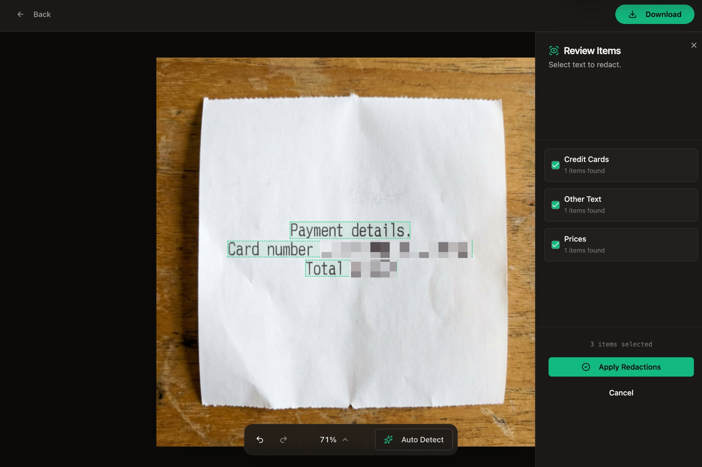

# [SimpleRedact](https://github.com/raztronaut/simpleredact)

A simple, secure, and privacy-focused image redaction tool. Featuring local, browser-based AI text detection powered by **Florence-2** via WebGPU. All processing stays on your device.

## The Interface


## The Results


## Features

-   **Client-Side Processing**: All image processing happens in your browser. No images are ever uploaded to a server.
-   **Pixel Perfect**: Beautiful pixelation effect for redacting sensitive information.
-   **Easy to Use**:
    -   Drag & drop images.
    -   Draw boxes to redact.
    -   Move and resize boxes easily.
    -   Download high-quality PNGs.
-   **Smart Auto-Redaction (Beta)**:
    -   Powered by **Florence-2** running locally in your browser (via WebGPU).
    -   Automatically detects **Emails**, **Phone Numbers**, **Credit Cards**, **Names**, **Addresses**, and **Prices**.
    -   **Context Aware**: Uses spatial analysis to understand document layout (e.g., finding the name next to "Customer:").
    -   **Review Sidebar**: Review and modify detected redactions before applying them.
-   **Keyboard Accessibility**:
    -   `Arrow Keys`: Move selected box (1px).
    -   `Shift + Arrow Keys`: Move selected box (10px).
    -   `Cmd/Ctrl +`: Zoom In.
    -   `Cmd/Ctrl -`: Zoom Out.
    -   `Cmd/Ctrl 0`: Fit to Screen.
    -   `Cmd/Ctrl 1`: Zoom to 100%.

## Known Issues

> [!WARNING]
> **AI Model Performance**: Local AI detection is in beta and still kinda poop tbh. It requires a compatible browser (Chrome/Edge with WebGPU recommended) and may be slow on legacy hardware. Initial model load (approx. 40MB) happens once and is cached.

## Tech Stack

-   **Framework**: [React](https://react.dev/) + [Vite](https://vitejs.dev/)
-   **Language**: [TypeScript](https://www.typescriptlang.org/)
-   **Styling**: [Tailwind CSS](https://tailwindcss.com/) + [Shadcn UI](https://ui.shadcn.com/)
-   **State Management**: [Zustand](https://github.com/pmndrs/zustand)
-   **Testing**: [Vitest](https://vitest.dev/) + [React Testing Library](https://testing-library.com/)

## Getting Started

1.  **Install dependencies**:
    ```bash
    npm install
    ```

2.  **Start development server**:
    ```bash
    npm run dev
    ```

3.  **Run tests**:
    ```bash
    npm test
    # or
    npx vitest run
    ```

4.  **Build for production**:
    ```bash
    npm run build
    ```

## Database (Production)

This project uses **SQLite**. For production, we recommend **Turso** (LibSQL) for a serverless, compatible experience.

1.  **Create Database**:
    ```bash
    turso db create simpleredact
    turso db show simpleredact --url
    turso db tokens create simpleredact
    ```

2.  **Environment Variables**:
    Add these to your production environment (e.g., Vercel):
    - `TURSO_DATABASE_URL`: The URL from `turso db show` (starts with `libsql://`)
    - `TURSO_AUTH_TOKEN`: The token created above

3.  **Push Schema**:
    Run this locally to push your schema to the remote database:
    ```bash
    TURSO_DATABASE_URL=... TURSO_AUTH_TOKEN=... yarn db:push
    ```

## Project Structure

-   `src/components`: UI components (Editor, Upload, etc.)
-   `src/store`: Application state (Zustand)
-   `src/hooks`: Custom hooks (Editor logic)
-   `src/lib`: Constants and utilities
-   `src/utils`: Image processing logic

## Auth Server (Optional)

SimpleRedact includes optional authentication for saving presets.

### Quick Start

```bash
# Run both frontend and auth server
yarn dev:all
```

### Environment Variables

Copy `.env.example` to `.env` and configure:

| Variable | Description |
|----------|-------------|
| `AUTH_PORT` | Auth server port (default: 3000) |
| `VITE_AUTH_URL` | Frontend: auth server URL |
| `PRODUCTION_URL` | Your production domain for CORS |
| `GOOGLE_CLIENT_ID` | Google OAuth client ID |
| `GOOGLE_CLIENT_SECRET` | Google OAuth secret |

### Deployment

1. Deploy auth server separately or as serverless function
2. Set `PRODUCTION_URL` to your frontend domain
3. Set `VITE_AUTH_URL` to your auth server URL
4. Add Google OAuth redirect URI: `https://your-api/api/auth/callback/google`

## License

MIT
